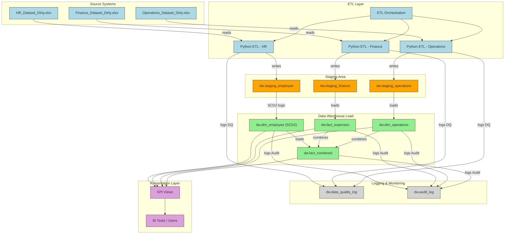

# Data-Warehousing-Assignment

##  Objective

Design and implement a Data Warehouse to consolidate data from **HR**, **Finance**, and **Operations** departments.  
The pipeline covers raw data ingestion, transformation, dimensional modeling, and user-specific access for secure data consumption.

---

##  Dataset Description

Three Excel datasets (dirty/inconsistent) are provided for ETL:

- `HR_Dataset_Dirty.xlsx` – Employee information  
- `Finance_Dataset_Dirty.xlsx` – Expense and approvals  
- `Operations_Dataset_Dirty.xlsx` – Process and downtime tracking  

Each file contains:
- Missing values
- Duplicates
- Format inconsistencies
- Non-standard naming conventions

---


##  Star Schema Design

The data warehouse follows a **Star Schema** with shared dimensions across HR, Finance, and Operations domains. This schema is optimized for analytical queries, KPI aggregations, and extensibility.

###  Dimensions
- **dim_employee**: Master employee info with SCD Type 2 tracking
- **dim_department**: Department names
- **dim_time**: Date-based hierarchy (day, month, quarter, year)
- **dim_expense_type**: Types of expenses (Travel, Supplies, etc.)
- **dim_process**: Operational process names
- **dim_location**: Site or plant locations

###  Fact Tables
- **fact_employee**: Daily employee snapshot with salary and status
- **fact_expenses**: Approved expenses by employee, with refund logic
- **fact_downtime**: Daily process downtime across departments and locations

###  Supporting Tables
- **data_quality_log**: Row-level DQ issues logged during ETL
- **audit_log**: Job-level metrics on data load quality and status

---

##  Key Relationships

- `fact_employee.employee_sk → dim_employee.employee_sk`
- `fact_employee.time_id → dim_time.time_id`
- `fact_expenses.employee_sk → dim_employee.employee_sk`
- `fact_expenses.expense_type_id → dim_expense_type.expense_type_id`
- `fact_downtime.process_id → dim_process.process_id`
- `fact_downtime.location_id → dim_location.location_id`
- `fact_downtime.department_id → dim_department.department_id`

---

##  SCD Type 2: Employee Dimension

- Changes in employee attributes (e.g., salary, department, status) result in new rows in `dim_employee`.
- `valid_from`, `valid_to`, and `is_current` fields track historical state.
- `fact_employee` captures daily snapshot by joining only current rows.


---

##  ERD / Schema Diagram


---

##  ETL Pipeline Design

The ETL process is divided into **modular stages**, one for each business domain (HR, Finance, Operations). It follows a **hybrid ETL/ELT** model and enforces audit logging, SCD handling, and data quality (DQ) checks.

---

###  Folder Structure

```bash
Data-Warehousing-Assignment/
|
+---01_DW_schema_and_roles_creation
|       combined_dw_schema.sql
|       User_roles.sql
|       
+---02_Extract_and_transform_raw_data
|   |   A2_hr_etl.py
|   |   B2_finance_etl.py
|   |   C2_ops_etl.py
|   |   ET_combined.py
|           
+---03_load_into_fact_and_dim_tables
|       A3_load_dim_emp.sql
|       B3_load_fin_facts.sql
|       C3_load_dim_ops.sql
|       TL_combines.sql
|       
+---04_KPI
|       KPIs.sql
|
|   Assignment_Instructions.txt
|   Finance_Dataset_Dirty.xlsx  
|   HR_Dataset_Dirty.xlsx
|   Operations_Dataset_Dirty.xlsx  

```

---

###  Features

- **Excel Ingestion**: Uses `pandas` to read raw `.xlsx` files
- **Data Cleaning**:
  - Fallback values for missing names, departments
  - Normalized gender, status, and date formats
  - Auto-generated surrogate keys
- **DQ Logging**:
  - Invalid/unclean values logged in `data_quality_log`
  - Per-job UUID tracking for traceability
- **Staging Layer**:
  - Cleaned data is written to `dw.staging_*` tables
- **Audit Logging**:
  - Each ETL stage writes a summary to `audit_log` with row counts
- **SCD Type 2 for dim_employee**:
  - Changed rows expire previous records and insert new ones
- **Incremental Loading**:
  - Fact tables insert only unique, non-duplicate records

---

## Setup Instructions
This project is divided into 3 main execution phases:

### Phase 1: Setup Schema and User Roles

### The Phase 1 needs to executed only one time and we do not need them again. You need to connect to postgres with root user privileges  

Before running any ETL or loading scripts, the database must be initialized with the required schema, tables, and user roles.

#### Step 1: Create Data Warehouse Schema and Tables


Execute the following SQL file using any PostgreSQL-compatible tool (`psql`, `pgAdmin`, etc.):

Connect to the postgre server as with Admin privilages, then execute these scripts:

bash
```
 CREATE DATABASE "ETL_DB";
```

This will create the Database ETL_DB.

* Make sure you connect to the correct `ETL_DB` database before running these scripts:

if using psql run the below commands to connect to the database connection:

```bash
\c ETL_DB
```

bash
```
\i <path>/01_DW_schema_and_roles_creation/combined_dw_schema.sql
```
* Make sure to use forward slash `/` in your path.

This script will:
- Create the `dw` schema if not exists
- Create all dimension and fact tables
- Create logging tables: `audit_log`, `data_quality_log`
- Create and populate `dim_time` with dates from 2020–2030 (plus fallback date for error handling)

#### Step 2: Create User Roles and Permissions(Role Based Access)

```bash
\i <path>/01_DW_schema_and_roles_creation/User_roles.sql
```
* Make sure to use forward slash `/` in your path.

This will:
- Create roles:
  - `hr_user` – read access to HR tables and KPIs
  - `finance_user` – read access to finance-related tables and KPIs
  - `super_user` – full read/write access to all schema objects
  - `staging_executor` – special role for executing ETL scripts and inserting into staging tables
- Grant appropriate `CONNECT`, `USAGE`, and `SELECT`/`INSERT`/`CREATE TEMP` permissions
- Ensure audit and DQ logs can be written by staging scripts


####  User Role Matrix

| Username          | Role Purpose                               | Password   |  
|-------------------|---------------------------------------------|--------------|
| `hr_user`         | HR analysts / viewers                       | `hr_pass`    |
| `finance_user`    | Finance analysts / controllers              | `fin_pass`   |
| `super_user`      | Admins and full-access users                | `super_pass` |
| `staging_executor`| ETL script executor (staging inserts only) | `stage_pass`  |

 \i C:/Users/kovvu/OneDrive/Desktop/Projects/Data-Warehousing-Assignment/01_DW_schema_and_roles_creation/combined_dw_schema.sql


## Phase 2: Extract and Transform
Run the combined Python ETL script:

```bash
pip install -r requirements.txt
```


```bash
python 02_Extract_and_transform_raw_data/ET_combined.py
```

 This will:
- Load and clean data from all Excel files (HR, Finance, Operations)
- Log data quality issues into dw.data_quality_log
- Insert cleaned data into staging tables:
  - `staging_employee`
  - `staging_finance`
  - `staging_operations`
- Insert audit entries into dw.audit_log

## Phase 3: Load into DW Tables
Run the SQL loader script using a PostgreSQL client like psql, pgAdmin, or DBeaver:
bash
```
\i <path>/03_load_into_fact_and_dim_tables/TL_combined.sql
```
* Make sure to use forward slash `/` in your path.

This will:
- Load data into dimension tables with SCD2 logic (`dim_employee`)
- Load snapshot and fact data into:
  - `fact_employee`
  - `fact_expenses`
  - `fact_downtime`
- Log audit entries for each load


## Phase 4: KPI Queries as Views

To simplify reporting and maintain separation of concerns, all KPI metrics are exposed as **views** in the warehouse schema (`dw`).

####  Run the View Creation Script

Use your PostgreSQL client (e.g. `psql`, `pgAdmin`) to execute the following script:


```bash
\i <path>/04_KPI/KPIs.sql
```

This script creates the following views:

| View Name | Description | Role Access |
|-----------|-------------|-------------|
| `dw.vw_kpi_headcount` | Monthly headcount of active employees | `hr_user`, `super_user` |
| `dw.vw_kpi_resignations` | Monthly resignation count | `hr_user`, `super_user` |
| `dw.vw_kpi_avg_salary_by_gender` | Average current salary by gender | `hr_user`, `super_user` |
| `dw.vw_kpi_gross_monthly_expenses_by_dept` | Monthly gross expenses grouped by department and type | `finance_user`, `super_user` |
| `dw.vw_kpi_net_monthly_expenses_by_dept` | Monthly net expenses including refunds | `finance_user`, `super_user` |
| `dw.vw_kpi_downtime_by_process` | Total/avg downtime grouped by process | `super_user` |
| `dw.vw_kpi_downtime_by_dept` | Total/avg downtime grouped by department | `super_user` |

---

These views rely only on **fact and dimension** tables and do not include any staging data.

These KPIs can now be queried by authorized roles (`hr_user`, `finance_user`, `super_user`) as per access control policies defined in `User_roles.sql`.

---

---

## End-to-End Pipeline Overview

The following diagram summarizes the full data pipeline implemented in **Phases 1 to 4**, covering:

- Schema creation and user role setup
- Python-based extraction and transformation
- Staging layer population
- Dimensional model loading with SCD Type 2
- Logging mechanisms (audit and data quality)
- Final KPI views consumed by BI tools

This visual helps understand the logical and data flow across all layers of the solution:




---
##  Outcomes & Summary of Work Done

This project demonstrates the end-to-end process of building a dimensional data warehouse, extracting and transforming raw data, and delivering analytics-ready insights.

###  Key Outcomes

- **Designed a Star Schema** with clear dimensional modeling for HR, Finance, and Operations domains.
- **Built robust ETL pipelines** using Python (for extract & transform) and SQL (for loading), incorporating:
  - Data quality checks
  - Audit logging
  - Error handling for invalid formats, missing references, and duplicates
- **Implemented SCD Type 2** for tracking historical changes in employee attributes.
- **Created KPI Views** using SQL for:
  - Headcount and attrition tracking
  - Salary analysis
  - Department-wise expenses
  - Process and departmental downtime
- **Enforced Role-Based Access** with PostgreSQL roles and grants for:
  - HR users
  - Finance users
  - Super users
  - Staging executors (for loading and DQ logging)
- **Structured project files** across schema creation, ETL scripts, fact/dim load steps, and KPI queries.


### Phase 5: DBT Transformation

Unlike the Python-based ETL used in earlier phases, this stage uses **DBT** to implement an **ELT** approach.

- **ETL vs ELT**: Previously, transformations were done before loading (ETL). DBT enables you to **extract and load first**, then **transform directly inside the data warehouse**.
- **Warehouse-Powered Processing**: All transformation logic is performed using the **compute power of the PostgreSQL data warehouse or any warehouse of choice**, improving scalability and traceability.
- **Modularity & Reusability**: DBT makes SQL logic modular with version control, testing, and environment-based runs.

To install DBT core:

```bash
pip install dbt-core dbt-postgres
```


```bash
dbt seed --full-refresh          # Load raw dirty CSVs into raw schema

# Transform to staging views
dbt run --select staging         # Clean + standardized staging models

# Build dims and fact tables
dbt run --select dims            # Materialize dimension tables

# Populate facts with SCD2 awareness and incremental logic
dbt snapshot                     # Build dim_employee as SCD2 snapshot

# Run fact models with audit/date logic
dbt run --select facts
```
This phase 5 implements the following improvements:
- **DBT Migration**: All logic modularized into DBT folders
- **Incremental Loads**: Only new rows are added to facts
- **SCD2 in Snapshots**: `dim_employee` tracks history using `dbt_valid_from` / `dbt_valid_to`

## Improvement under way
- **DBT Migration**: 
  - **Audit Logging**: Fact and dim models log job runs in `dw.audit_log`
  - **Data Quality Logging**: Raw ETL issues are written to `dw.data_quality_log`
  - **Tests** : Generate Tests and View with DBT

- **Power BI** Integration: Build KPI dashboards using Power BI.
